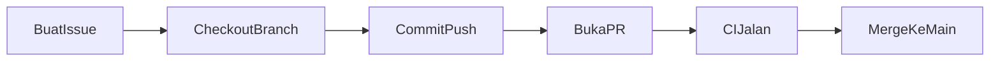

# Panduan Kontribusi

Terima kasih mau belajar workflow GitHub di repo ini! Ikuti alur di bawah untuk latihan issue → PR → merge.

## Alur Standar



## Konvensi Branch

| Prefix | Kapan dipakai | Contoh |
|--------|---------------|--------|
| `feat/` | Fitur baru | `feat/multiply` |
| `fix/` | Perbaikan bug | `fix/divide-by-zero` |
| `docs/` | Perubahan dokumentasi | `docs/readme-pr-example` |

```bash
git checkout main
git pull origin main
git checkout -b feat/nama-fitur
```

## Format Commit

Gunakan [Conventional Commits](https://www.conventionalcommits.org/) ringkas:

```
feat: tambah fungsi multiply
fix: handle pembagian dengan nol
docs: lengkapi README dengan contoh PR
```

## Buat Issue

### Via GitHub Web

1. Buka tab **Issues** → **New issue**
2. Pilih template (Bug report, Feature request, atau Latihan)
3. Isi form → **Submit**

### Via CLI

```bash
gh issue create --title "feat: tambah fungsi multiply" --body "Implementasi fungsi multiply di calculator.py"
```

## Buat Pull Request

### Via GitHub Web

1. Push branch ke remote
2. Klik **Compare & pull request** di banner GitHub
3. Isi template PR (Summary, Issue terkait, Test plan)
4. Submit PR

### Via CLI

```bash
git push -u origin feat/nama-fitur
gh pr create --title "feat: tambah fungsi multiply" --body "Closes #1"
```

Tulis `Closes #N` di body PR agar issue otomatis tertutup saat merge.

## Review & Merge

1. Tunggu CI (pytest) hijau
2. Review perubahan di tab **Files changed**
3. Merge dengan **Squash and merge** (disarankan untuk belajar)
4. Hapus branch setelah merge

## Menjalankan Test Lokal

```bash
pip install pytest
pytest tests/ -v
```

## Latihan Terstruktur

Lihat folder [docs/latihan/](docs/latihan/) untuk checklist step-by-step.
